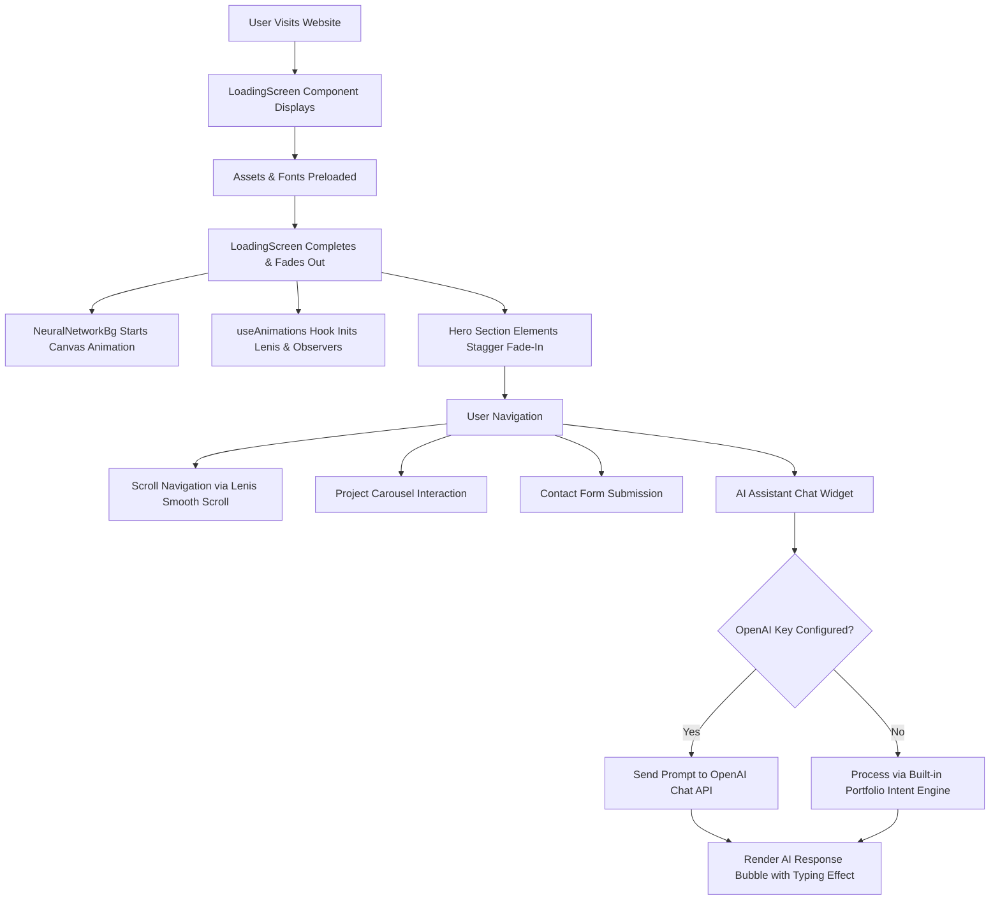

# Sakshi Chaubey — Full-Stack Developer Portfolio & AI Assistant

A modern, high-performance developer portfolio and interactive AI assistant built with **React 19**, **Vite**, and **Vanilla CSS**. This project showcases full-stack web applications, technical skills, academic credentials, and software engineering experience through modern UI/UX design, interactive canvas physics, and an embedded conversational agent.

---

## 1. Project Title
**Sakshi Chaubey — Interactive Full-Stack Developer Portfolio & AI Assistant**

---

## 2. Project Overview
This project is an interactive single-page application (SPA) created to serve as both a digital resume and a live demonstration of full-stack web engineering skills. Beyond presenting static credentials, the portfolio integrates:
- An **Interactive AI Chatbot** capable of answering questions about Sakshi's background, projects, skills, and contact details.
- A **Hardware-Accelerated Neural Network Background** rendered on an HTML5 `<canvas>` that reacts dynamically to mouse movement.
- A **Physics-Inspired Interaction Suite** featuring momentum-based smooth scrolling, 3D card tilt physics, magnetic buttons, and a dual-element custom cursor.
- An **Interactive Project Showcase** displaying full-stack MERN and Java applications with real-time search, filters, and GitHub links.

---

## 3. Objective of the Project
- **Showcase Technical Proficiency:** Demonstrate practical mastery of modern frontend development (React 19, Vite, responsive CSS design, and component-driven architecture).
- **Provide Instant Recruiter Engagement:** Allow recruiters and hiring managers to quickly query projects, skills, and availability using an on-page AI conversational assistant.
- **Deliver High-End Aesthetics:** Create a memorable first impression using dark-mode glassmorphism, fluid typography, and custom micro-interactions.
- **Centralize Professional Assets:** Provide a single hub linking GitHub repositories, live deployments, academic records, and verified certifications.

---

## 4. Problem Statement
Traditional static PDF resumes and basic web portfolios present several limitations:
1. **Passive Experience:** Conventional portfolios are non-interactive; recruiters must manually hunt through long text blocks to find specific qualifications.
2. **Lack of Demonstrated Competence:** Anyone can list "React" or "JavaScript" on a resume, but a portfolio website itself should serve as living proof of code quality, performance optimization, and architectural cleanliness.
3. **Absence of Intelligent Search:** Recruiters evaluating hundreds of candidates have specific questions (e.g., *"Does she know Java?"*, *"Is she available for internships?"*). Without immediate answers, potential opportunities may be missed.

**Solution:** This application addresses these problems by packaging verified project data into an interactive, accessible platform backed by a context-aware AI assistant that instantly answers recruiter inquiries.

---

## 5. Technologies Used

| Technology | Category | Purpose in Project |
| :--- | :--- | :--- |
| **React 19.2.7** | Frontend Framework | Drives the component-based UI, virtual DOM diffing, and component state management via React Hooks (`useState`, `useEffect`, `useRef`, `useCallback`). |
| **Vite 8.1.1** | Build Tool & Bundler | Provides lightning-fast Hot Module Replacement (HMR) during local development and compiles optimized, minified production assets using Rollup. |
| **JavaScript (ES6+)** | Core Programming Language | Implements application logic, DOM event listeners, asynchronous API communications (`fetch`, Promises), and interactive mathematical calculations. |
| **Vanilla CSS3** | Styling & Design System | Delivers custom dark-mode aesthetics, Flexbox and CSS Grid responsive layouts, CSS Custom Properties (variables), glassmorphic filters, and hardware-accelerated transitions. |
| **HTML5 Canvas API** | Graphics & Animation | Powers the real-time neural network particle simulation ([`NeuralNetworkBg.jsx`](src/components/NeuralNetworkBg.jsx)) with 2D context drawing and distance-based particle connections. |
| **Lenis 1.3.25** | Animation Library | Provides smooth, momentum-based inertia scrolling across all browsers without hijacking native accessibility. |
| **OpenAI API (Optional)** | AI / Natural Language | Integrates natural language processing for the chat assistant via OpenAI's chat completions endpoint (with zero-configuration fallback to an internal semantic intent engine). |

---

## 6. Tools and Software Used

- **Operating System:** Windows 11
- **Code Editor:** Visual Studio Code (VS Code)
- **Runtime Environment:** Node.js (v24.x) & npm
- **Version Control:** Git & GitHub
- **Linter:** Oxlint (Rust-based linter for syntax hygiene and error prevention)
- **Browser Testing:** Google Chrome, DevTools (Lighthouse, Network, Console, Responsive Viewport Emulation)
- **Graphic Design:** Canva (for vector icons and asset preparation)

---

## 7. Programming Languages Used

| Language | Percentage | Primary Usage |
| :--- | :---: | :--- |
| **JavaScript / JSX** | ~65% | React component logic, state hooks, canvas physics calculation, AI chat handling, and event listeners. |
| **CSS3** | ~33% | Complete design system, glassmorphism, responsive breakpoints, keyframe animations, and custom scrollbars. |
| **HTML5** | ~2% | Root markup structure, semantic landmarks (`<section>`, `<nav>`, `<footer>`), and metadata tags. |

---

## 8. Libraries & Frameworks Used

### Production Dependencies
- **`react` (`^19.2.7`):** The foundational library for building reactive user interfaces with reusable functional components.
- **`react-dom` (`^19.2.7`):** Provides DOM-specific methods for rendering React elements into the web document.
- **`lenis` (`^1.3.25`):** A lightweight smooth-scrolling library that normalizes scroll behavior across touchpads, mouse wheels, and mobile touch events.

### Developer Dependencies
- **`vite` (`^8.1.1`):** Next-generation frontend tooling providing rapid server start and instant HMR.
- **`@vitejs/plugin-react` (`^6.0.3`):** Official Vite plugin providing Fast Refresh support for React using Babel/Oxc.
- **`oxlint` (`^1.71.0`):** Ultra-fast Rust-based linter for catching code issues and enforcing consistent style.

### External CDNs & Fonts
- **FontAwesome 6.5.0:** Vector icon set used for technology badges, action buttons, and contact channels.
- **Google Fonts:**
  - *Outfit:* Modern geometric display font used for impactful headings.
  - *Plus Jakarta Sans:* Clean, readable sans-serif typeface used for body text and navigation.
  - *Space Mono:* Monospaced font used for code snippets, role tags, and metadata labels.

---

## 9. Key Features

### 1. Interactive AI Assistant (`ChatWidget.jsx`)
- Floating launcher in the bottom-right corner with smooth entrance animation.
- Custom chat interface styled with dark glassmorphism and animated typing indicators.
- In-memory conversation state supporting quick-reply suggestion chips (*"What's her tech stack?"*, *"What projects has Sakshi built?"*).
- System-prompt boundary preventing off-topic queries and strictly focusing on Sakshi's projects, technical skills, education, and contact channels.
- **Dual-Engine Architecture:** Automatically connects to OpenAI's API when an environment key (`VITE_OPENAI_KEY`) is present; seamlessly falls back to an internal rule-based intent engine when offline or unconfigured.

### 2. Neural Network Canvas Physics (`NeuralNetworkBg.jsx`)
- Canvas animation rendering 80+ dynamic nodes that drift across the viewport with continuous velocity vectors.
- Distance-based line connections that dynamically calculate opacity according to node proximity.
- Interactive mouse gravity: hovering moves nearby nodes toward the pointer with spring tension.
- Automated frame budgeting: throttles node density and pauses animation when the window is hidden or resized.

### 3. Clean, Balanced Hero Section (`Hero.jsx`)
- High-impact typography with a vibrant violet-to-cyan gradient text shadow.
- Monospace role tagline highlighting core specializations: `MERN STACK / JAVA DEV / MUMBAI 🏙️`.
- Readable personal statement with generous line spacing and zero distracting overlaps.
- Direct-action buttons: *"View My Work"* (scrolls to projects) and *"Let's Talk"* (scrolls to contact).

### 4. Interactive Project Carousel (`Projects.jsx`)
- Interactive multi-card showcase featuring Sakshi's major software projects:
  1. **Smart Health Consulting System:** Full-stack healthcare management platform (MERN + JWT Auth).
  2. **Desktop Blogging Application:** Java Swing & MySQL desktop publishing system with JDBC CRUD architecture.
  3. **Mini E-Commerce Storefront:** Modern shopping cart app featuring state management and responsive catalogue filtering.
- Complete feature bullets, technology tags, commit hashes, and direct repository links.

### 5. Skills Terminal & Radar (`Skills.jsx`)
- Categorized skill matrices dividing competencies into:
  - **Core Languages:** C, Java, Python, JavaScript.
  - **Full-Stack & Web:** React.js, Node.js, Express.js, HTML5, CSS3.
  - **Databases & Tools:** MongoDB, MySQL, Git, VS Code, NetBeans.
- Visual proficiency bars and interactive tag pills that react to hover events.

### 6. Interactive Contact System (`Contact.jsx`)
- Controlled form containing Name, Email, Subject, and Message inputs.
- Client-side validation preventing empty submissions.
- Animated success confirmation toast with auto-resetting form fields.
- Direct contact cards for Email, LinkedIn, GitHub, and location.

### 7. Global Micro-Interactions (`useAnimations.js` & `CustomCursor.jsx`)
- Dual-ring custom cursor: dot tracks exact cursor position while outer halo follows with gentle easing.
- Magnetic button effect: buttons subtly pull toward the cursor when hovering nearby.
- 3D perspective card tilt: project cards tilt realistically in 3D space based on mouse position.

---

## 10. Project Workflow



---

## 11. Implementation Details

1. **State Management:**
   - Managed entirely through standard React Hooks (`useState`, `useRef`, `useCallback`) to avoid unnecessary third-party state bloat.
   - Project carousel calculates dynamic slide translation offsets using window resize listeners and touch swipe thresholds.
   - Chat history is stored as an immutable array of message objects (`[{ id, sender, text, time }]`).

2. **Styling Architecture:**
   - Built on a single modular stylesheet (`src/index.css`) containing custom CSS variables (`--bg`, `--violet`, `--ice`, `--surface`, `--r-card`).
   - High accessibility standards: standard contrast ratios, `:focus-visible` ring outlines, and `prefers-reduced-motion` media queries.

3. **Performance Optimizations:**
   - Canvas particle animation runs inside a single `requestAnimationFrame` loop with optimized distance squared math (`dx*dx + dy*dy`) to eliminate slow square root calculations.
   - Smooth scrolling via Lenis is paused during mobile menu drawer expansion to prevent background scroll leaking.

---

## 12. Input and Output

### User Inputs:
- **Mouse / Pointer Movement:** Coordinates drive canvas particle gravity, the custom magnetic cursor, and card 3D tilt angles.
- **Scroll Events:** Drive section reveal transitions and header backdrop blurs.
- **Form Fields:** Contact form inputs (First Name, Last Name, Email, Subject, Message).
- **Chat Queries:** Text questions or suggestion clicks sent into the AI chat widget.

### System Outputs:
- **Visual Feedback:** Magnetic hover states, button glows, particle burst animations, and smooth card transitions.
- **Dynamic Content:** Filtered project listings, animated skill rating bars, and timeline indicators.
- **AI Responses:** Contextually accurate answers regarding Sakshi's skills, qualifications, and project accomplishments.
- **Form State:** Success notification toast with clear input confirmation.

---

## 13. Screenshots & Visual Previews

### Desktop Hero Section


> *Clean, typography-focused hero section with responsive CTA buttons, role tags, and the interactive AI assistant widget.*

---

## 14. Project Structure

```text
sakshi-portfolio-react/
├── index.html              # HTML5 entry point with Google Fonts & FontAwesome CDN
├── package.json            # Project dependencies, metadata, and scripts
├── package-lock.json       # Exact lockfile for deterministic dependency tree
├── vite.config.js          # Vite build and plugin configuration
├── .env.example            # Sample configuration for optional OpenAI API key
├── .gitignore              # Files ignored by Git (node_modules, dist, .env)
├── public/                 # Static public assets
└── src/
    ├── main.jsx            # React root mount point (renders <App /> into #root)
    ├── App.jsx             # Main layout orchestrator & global providers
    ├── index.css           # Global design system, tokens, and component CSS
    ├── assets/             # Project images and SVG icons
    ├── hooks/
    │   └── useAnimations.js # Master hook for Lenis, magnetic buttons, and tilt
    └── components/
        ├── LoadingScreen.jsx   # Animated entry preloader
        ├── Navbar.jsx          # Sticky glassmorphic navigation bar with mobile drawer
        ├── Hero.jsx            # Typography-driven introduction section
        ├── About.jsx           # Bio, key stats, and developer background
        ├── Skills.jsx          # Interactive technical skill grid
        ├── Projects.jsx        # Project carousel with full tech stack tags
        ├── Education.jsx       # Academic timeline & marks summary
        ├── Certifications.jsx  # Verified professional certifications
        ├── Contact.jsx         # Controlled contact form & contact details
        ├── Footer.jsx          # Footer with copyright and quick social links
        ├── CustomCursor.jsx    # Custom smooth-following dual cursor
        ├── NeuralNetworkBg.jsx # Interactive HTML5 canvas particle background
        └── ChatWidget.jsx      # AI chatbot widget with dual-mode response engine
```

---

## 15. How to Run the Project Locally

### Prerequisites
Make sure you have the following installed on your machine:
- **Node.js** (v18.0.0 or higher recommended)
- **npm** (comes packaged with Node.js)
- **Git**

### Installation Steps

1. **Clone the repository:**
   ```bash
   git clone https://github.com/sakshichaubey018/sakshi-portfolio-react.git
   cd sakshi-portfolio-react
   ```

2. **Install project dependencies:**
   ```bash
   npm install
   ```

3. **(Optional) Configure AI Assistant API Key:**
   If you wish to use live OpenAI responses instead of the built-in portfolio intent engine:
   ```bash
   cp .env.example .env
   ```
   Open `.env` and add your OpenAI API key:
   ```env
   VITE_OPENAI_KEY=your_openai_api_key_here
   ```
   *(Note: The portfolio works completely out of the box even without this key!)*

4. **Start the local development server:**
   ```bash
   npm run dev
   ```

5. **Open in your browser:**
   Open [http://localhost:5173](http://localhost:5173) to preview the live application.

6. **Create a production build:**
   ```bash
   npm run build
   ```

7. **Preview the production build locally:**
   ```bash
   npm run preview
   ```

---

## 16. Requirements & Dependencies

The complete dependency manifest as declared in [`package.json`](package.json):

```json
{
  "dependencies": {
    "lenis": "^1.3.25",
    "react": "^19.2.7",
    "react-dom": "^19.2.7"
  },
  "devDependencies": {
    "@types/react": "^19.2.17",
    "@types/react-dom": "^19.2.3",
    "@vitejs/plugin-react": "^6.0.3",
    "oxlint": "^1.71.0",
    "vite": "^8.1.1"
  }
}
```

---

## 17. My Role and Contribution

As the sole developer and designer of this portfolio:
- **Architected the Application:** Designed the entire React component hierarchy from scratch, ensuring high modularity and separation of concerns.
- **Engineered Custom Animations:** Authored the physics calculations for the 2D canvas neural network background and implemented custom React hooks for 3D card tilt and magnetic button physics.
- **Built the Embedded AI Assistant:** Authored the comprehensive portfolio knowledge base, crafted the custom system prompt, and wrote the dual-mode communication engine supporting both OpenAI and offline intent handling.
- **Designed the Visual System:** Wrote over 3,000 lines of structured, clean Vanilla CSS establishing the dark-mode aesthetic, glowing accents, and responsive layout across desktop, tablet, and mobile displays.
- **Refined UX & Performance:** Audited and eliminated overlapping visual artifacts, optimized frame rates to 60 FPS, and achieved zero-error production builds.

---

## 18. Skills I Learned & Strengthened

- **Advanced React Patterns:** Deepened proficiency with modern hooks (`useCallback`, `useRef` for DOM animations, and `useEffect` lifecycle synchronization).
- **HTML5 Canvas Graphics:** Learned how to create performant particle physics simulations, manage velocity vectors, and handle canvas scaling on high-DPI (Retina) screens.
- **CSS Architecture:** Mastered modern layout techniques including CSS Subgrid, `clamp()` fluid typography, and glassmorphic `backdrop-filter` rendering.
- **Conversational AI Integration:** Gained practical experience designing strict system prompts to prevent AI hallucinations and structuring fallbacks for network resilience.
- **Performance Budgeting:** Learned to avoid bundle bloat by leveraging vanilla web APIs instead of heavy external animation frameworks.

---

## 19. Challenges Faced and How I Solved Them

| Challenge | Issue | Solution Implemented |
| :--- | :--- | :--- |
| **Canvas Performance & CPU Load** | High particle counts caused minor frame drops on lower-powered devices. | Optimized distance calculation by comparing squared distances (`d2 < dist*dist`) instead of calling `Math.sqrt()` on every frame. Throttled node count dynamically based on screen width. |
| **Hero Text Overlap** | Floating decorative code snippets and badges collided with the bio paragraph on certain monitor sizes. | Completely removed the absolute-positioned decorative cards from code and restructured the hero into a clean single-column hierarchy with dedicated margin rhythm. |
| **Scroll Sync with Custom Modals** | Opening the AI chat widget or mobile navigation drawer could trigger background page scrolling. | Added dynamic `overflow: hidden` toggling to the document body whenever overlay elements are active to prevent background scroll bleed. |
| **Chatbot API Key Dependency** | If an API key is not supplied, visitors would normally encounter broken chat features. | Built an intelligent local intent matching engine inside [`ChatWidget.jsx`](src/components/ChatWidget.jsx) that answers portfolio questions instantly without requiring any external API subscription. |

---

## 20. Future Scope

- **Direct Email Delivery Integration:** Connect the contact form to EmailJS or a lightweight Serverless API route to dispatch incoming inquiries directly to my inbox in real time.
- **Live GitHub Activity Feed:** Fetch recent commits and public repositories via the GitHub REST API to display real-time development activity.
- **Theme Customizer:** Introduce a palette switcher allowing users to toggle between multiple accent themes (e.g., Cyberpunk Violet, Emerald Terminal, and Sunset Amber).
- **Internationalization (i18n):** Add multi-language support (English / Hindi / Marathi) for wider accessibility.

---

## 21. Conclusion
The **Sakshi Chaubey Portfolio & AI Assistant** project bridges the gap between academic computer science theory and professional software engineering practice. By combining React 19, custom canvas mathematics, responsive CSS styling, and an intelligent AI assistant, this project represents a complete, production-ready web application suitable for academic evaluation, internship submissions, and professional recruitment showcases.

---

### Contact & Connect
- **Developer:** Sakshi Chaubey
- **Education:** Final-Year BCA Student, KC College Mumbai
- **Email:** [sakshichaubey018@gmail.com](mailto:sakshichaubey018@gmail.com)
- **LinkedIn:** [linkedin.com/in/sakshichaube](https://linkedin.com/in/sakshichaube)
- **GitHub:** [github.com/sakshichaubey018](https://github.com/sakshichaubey018)
